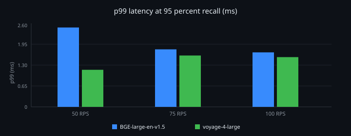

# bgebenchy

Motion-shaped catalog embedding benchmark. Compares [BAAI/bge-large-en-v1.5](https://huggingface.co/BAAI/bge-large-en-v1.5) and [voyage-4-large](https://huggingface.co/voyageai/voyage-4-large) at **10,000 documents**, **1024-d fp16**, **23 filter fields**, **3 full-text fields**, targeting **95% recall@10**.

Interactive layout of these same numbers: Cursor canvas `bge-large-10k-benchmark`.

## Results

Same corpus, cosine HNSW (usearch, M=16, `ef_construction=128`, `ef_search=16`). Open-loop load: 5s warmup + 20s measure. Zero late starts at 50 / 75 / 100 RPS.

| | BGE-large-en-v1.5 | voyage-4-large |
|---|---:|---:|
| Recall@10 | **95.45%** | **95.65%** |
| p99 at 100 RPS | 1.70 ms | 1.55 ms |
| Index build | 0.24 s | 0.22 s |
| HNSW memory | 32.1 MB | 32.1 MB |

Latency is **local in-process ANN on the host below**. It does not include MongoDB, mongot, network, or Lucene filter / full-text cost.

### Host machine

These stored results were generated on this machine:

| | |
|---|---|
| Model | MacBook Pro (Mac16,7) |
| Chip | Apple M4 Pro, 14 cores (10 performance / 4 efficiency) |
| Memory | 24 GB |
| OS | macOS 26.6.1 (25G76), Darwin 25.6.0 |
| Runtime | Python 3.12, usearch HNSW, single-thread search |

### p99 latency by model

Grouped bar chart from the canvas: p99 (ms) at the 95% recall operating point.



### Latency (ms) at 95% recall, `ef_search=16`

| Model | RPS | p50 | p90 | p95 | p99 | Recall@10 |
|---|---:|---:|---:|---:|---:|---:|
| BGE-large-en-v1.5 | 50 | 0.271 | 0.614 | 0.791 | 2.468 | 0.9545 |
| BGE-large-en-v1.5 | 75 | 0.260 | 0.606 | 0.775 | 1.789 | 0.9545 |
| BGE-large-en-v1.5 | 100 | 0.245 | 0.473 | 0.715 | 1.695 | 0.9545 |
| voyage-4-large | 50 | 0.501 | 0.669 | 0.767 | 1.154 | 0.9565 |
| voyage-4-large | 75 | 0.492 | 0.711 | 0.894 | 1.598 | 0.9565 |
| voyage-4-large | 100 | 0.507 | 0.732 | 0.868 | 1.548 | 0.9565 |

JSON copies: [`stored_results/bge-large-en-v1.5.json`](stored_results/bge-large-en-v1.5.json), [`stored_results/voyage-4-large.json`](stored_results/voyage-4-large.json).

## Index configuration

**23 filter fields:** `productNumber`, `vendorName`, `vendorPartNumber`, `UserTypeID`, `ParentID`, `MotionId`, `StepId`, `UNSPSC`, `ManufacturerID`, `mfr_name_NM`, `product_type_LOV`, `Active`, `WebStatus`, `ItemUOM`, `PGC_CODE`, `bearing_type_LOV`, `cage_type_LOV`, `parent_id_ID`, `eCOS_PGC`, `Prop65`, `company_name`, `ItemNumber`, `meta.source`

**3 full-text fields:** `WebProductDescription`, `DerivedProductDescription`, `descriptionKeywords`

Vector path: `embedding`, 1024 dimensions, cosine, pre-quantized fp16 (`quantization: none`). Voyage used `input_type` `document` / `query`; BGE used the official query prefix.

## Run

```bash
python3 -m venv .venv
source .venv/bin/activate
pip install -r requirements.txt

python -m benchmark.run --model bge-large-en-v1.5 --docs 10000 --queries 200 \
  --rps 50,75,100 --data-dir data/bge-large-en-v1.5 --results-dir results/bge-large-en-v1.5

# Voyage requires VOYAGE_API_KEY in the environment (or a gitignored .env)
python -m benchmark.run --model voyage-4-large --docs 10000 --queries 200 \
  --rps 50,75,100 --data-dir data/voyage-4-large --results-dir results/voyage-4-large
```
